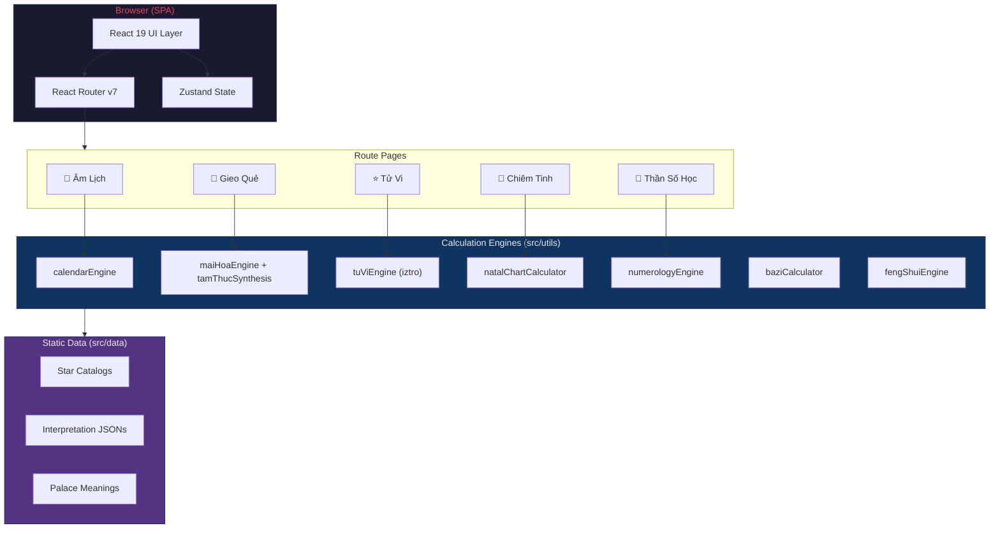

# 🌙 Lịch Việt v2

**Vietnamese Lunar Calendar & Metaphysical Analysis Platform**

A comprehensive web application for Vietnamese lunar calendar lookup, auspicious day analysis, and multiple Eastern/Western divination systems — built with React 19, TypeScript, and Vite 7.

## 🏗 Architecture



## ✨ Features

### 📅 Lunar Calendar
- Solar ↔ Lunar date conversion with Vietnamese month/year naming
- Auspicious activity scoring (8 factors: Ngọc Hạp, Hiệp Kỷ, Ngũ Hành, and more)
- Giờ tốt/xấu (auspicious hours) and hướng xuất hành (travel direction)

### 🔮 Divination Engines
| Engine | Description |
|---|---|
| **Tử Vi** (紫微) | Purple Star astrology with 12-palace chart, temporal overlays (Đại Hạn, Lưu Niên), and Tứ Hóa analysis |
| **Bát Tự** (八字) | Four Pillars of Destiny with Thập Thần, Tàng Can, Branch Interactions, and Trường Sinh |
| **Chiêm Tinh** | Western Natal Chart with aspect patterns, secondary progressions, and interactive sky map |
| **Thần Số Học** | Numerology (Pythagorean & Chaldean) with Life Path, Expression, Soul Urge, and life cycles |
| **Mai Hoa** (梅花) | Plum Blossom Numerology with Thể/Dụng trigrams and Ngũ Hành interpretation |
| **Kỳ Môn Độn Giáp** | QMDJ multi-layered board (stems, stars, doors, deities) |
| **Lục Nhâm** | Six Ren divination with Heaven/Earth board rotation |
| **Thái Ất** | Thai At 16-palace cycle system |
| **Phi Tinh** | Flying Star Feng Shui with Luo Shu grid and 24-mountain compass |

### 🎨 Design
- Dark mode with glassmorphism and ambient mystery effects
- Mobile-first responsive design
- `prefers-reduced-motion` accessibility support across all stylesheets
- Self-hosted Inter font family with Vietnamese character support

### ♿ Accessibility
- WCAG 2.1 AA focus-visible indicators
- `prefers-reduced-motion` across all animations
- `jsx-a11y` linting enforced
- `aria-current` page navigation
- Semantic HTML with ARIA labels

## 🛠 Tech Stack

| Layer | Technology |
|---|---|
| Framework | React 19 + TypeScript 5.8 |
| Build | Vite 7 |
| Styling | Tailwind CSS v4 + vanilla CSS |
| State | Zustand |
| Routing | React Router v7 |
| Testing | Vitest + @testing-library/react |
| Linting | ESLint 9 (flat config) + jsx-a11y + Prettier |
| CI | GitHub Actions (lint, type-check, test, build, security audit) |

## 🚀 Getting Started

### Prerequisites
- Node.js ≥ 20
- npm ≥ 10

### Installation

```bash
# Clone the repository
git clone https://github.com/jakessteve/lich-viet-v2.git
cd lich-viet-v2

# Install dependencies
npm install

# Start development server
npm run dev
```

### Available Scripts

| Command | Description |
|---|---|
| `npm run dev` | Start Vite dev server |
| `npm run build` | TypeScript check + production build |
| `npm run preview` | Preview production build |
| `npm test` | Run Vitest test suite |
| `npm run test:watch` | Run tests in watch mode |
| `npm run test:coverage` | Run tests with coverage report |
| `npm run lint` | Lint source files |
| `npm run lint:fix` | Auto-fix lint issues |
| `npm run format` | Format with Prettier |
| `npm run validate:data` | Validate static data files |

## 📁 Project Structure

```
src/
├── components/     # React UI components (calendar, charts, forms)
├── config/         # Application configuration constants
├── data/           # Static datasets (star catalogs, interpretation data)
├── hooks/          # Custom React hooks
├── i18n/           # Internationalization / Vietnamese translations
├── router/         # React Router route definitions
├── schemas/        # Zod validation schemas
├── services/       # External API integrations (geocoding, holidays)
├── stores/         # Zustand state management
├── styles/         # Feature CSS + self-hosted fonts
├── types/          # TypeScript type definitions
├── utils/          # Calculation engines (bazi, tuvi, astro, etc.)
├── workers/        # Web Workers for heavy computation
└── index.css       # Design system tokens and shared utilities

test/               # Vitest test suite (organized by phase)
packages/           # Shared core logic & types (monorepo)
public/             # Static assets, fonts, icons, SEO files
docs/               # Architecture, PRD, and phase archives
```

## 🧪 Testing

```bash
# Run all tests (712 tests across 43 files)
npm test

# Run with coverage
npm run test:coverage
```

**Test suite covers:** Calendar calculations, Bazi engine, Western astrology, activity scoring, numerology, Mai Hoa, Tam Thức synthesis, Feng Shui, component rendering, hooks, stores, i18n, and more.

## 📖 Documentation

- [CONTRIBUTING.md](./CONTRIBUTING.md) — Contribution guidelines
- [CHANGELOG.md](./CHANGELOG.md) — Version history
- [SECURITY.md](./SECURITY.md) — Security model and environment variables
- [PAID_TIERS.md](./PAID_TIERS.md) — Feature tiers and monetization strategy
- [docs/ARCHITECTURE.md](./docs/ARCHITECTURE.md) — System architecture overview
- [docs/PRD.md](./docs/PRD.md) — Product requirements document
- [docs/ENGINE_DEPENDENCY_GRAPH.md](./docs/ENGINE_DEPENDENCY_GRAPH.md) — Engine dependency visualization

## 📄 License

MIT © Lịch Việt Contributors
