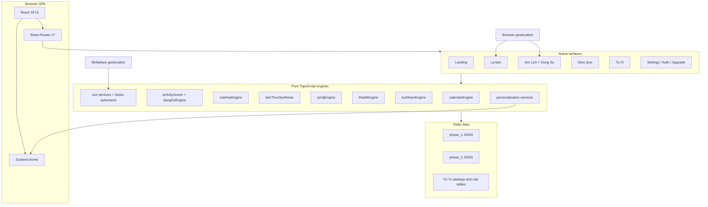

# Lich Viet v3

Vietnamese lunar calendar, La bàn Phong Thủy, auspicious-day analysis, divination tools, and Tử Vi charting in a focused client-side web app.

Lich Viet v3 is a browser-only React SPA. It centers on five active surfaces: the landing page, Am Lich for calendar and Dung Su workflows, La bàn for 24 Sơn / Phi Tinh compass analysis, Gieo Que for Mai Hoa and Tam Thuc divination, and Tu Vi for birthplace-aware Tử Vi Đẩu Số charts. Viewer geolocation now feeds the live calendar surface, La bàn can use phone sensor input on mobile browsers, while Tu Vi uses birthplace geolocation and Swiss true-solar correction when available.

## Highlights

- Browser geolocation-aware calendar calculations for the live Am Lich surface.
- Sensor-backed La bàn for 24 Sơn and Huyền Không Phi Tinh.
- Birthplace-aware Tu Vi charting with Swiss ephemeris support and true-solar correction.
- Lunar solar conversion, Can Chi, auspicious hours, holiday lookup, and day detail in one place.
- Mai Hoa, Tam Thuc, QMDJ, Thai Ất, and Lục Nhâm workflows under one divination surface.
- Client-side only architecture with no backend server.
- Local auth, settings, upgrade status, and route redirects are all inside the same SPA shell.

## Feature Surface

| Surface | What it does | Key routes |
| --- | --- | --- |
| Landing | Product intro, birthday input, cosmic weather card, testimonials, CTA flow | `/` |
| Am Lich | Solar-lunar lookup, month calendar, day detail, holidays, good/bad hours, travel directions, viewer-location-aware lunar calculations | `/app/am-lich` |
| La bàn | 24 Sơn compass, Phi Tinh chart, heading lock, sensor input, Tử Vi overlay | `/app/la-ban` |
| Dung Su | Activity scoring, factor breakdowns, best-time guidance, Dung Sự calendar views | `/app/am-lich` |
| Gieo Que | Mai Hoa hexagrams, Tam Thuc synthesis, QMDJ, Thai Ất, Lục Nhâm | `/app/gieo-que` |
| Tu Vi | Birthplace-aware Tử Vi Đẩu Số charts, school variants, exports, true-solar correction | `/app/tu-vi` |
| Settings | Theme, font size controls | `/app/cai-dat` |
| Auth | Local demo login and register screens | `/app/dang-nhap`, `/app/dang-ky` |
| Upgrade | Pricing / coming-soon status page | `/app/nang-cap` |

## Core Functions

| Area | Main functions and modules | Purpose |
| --- | --- | --- |
| Calendar engine | `getLunarDate`, `getMonthDays`, `getDetailedDayData`, `getDayQuality`, `getCanChiDay`, `getCanChiMonth`, `getCanChiYear`, `getAuspiciousHours` | Solar-lunar conversion, day metadata, and calendar grid data |
| Swiss astronomy | `getSwissLunarDate`, `getSwissLunarDateIfReady`, `getSwissTrueSolarCivilTimeForLocation`, `findSwissSolarTermBoundary` | High-precision astronomical conversion and true-solar correction |
| Holidays | `useHolidays` | Vietnamese holidays plus local-country holiday lookup |
| Viewer location | `useViewerLocation`, `buildSwissGeoLocation`, `estimateTimezoneOffsetHours` | Browser geolocation to Swiss location contract |
| Tu Vi birth context | `buildTuViBirthContext`, `normalizeBirthTimeWithPolicy`, `normalizeBirthTime` | Birthplace normalization, leap-month handling, and true-solar correction |
| Tu Vi charting | `generateChart`, `calculateHanContext`, `calculateCenterInfo`, `formatTuViChartAsMarkdown` | Chart generation, star placement, and export formatting |
| Feng Shui compass | `generateLouPanChart`, `generateFlyingStarChart`, `calculateAnnualStar`, `calculateMonthlyStar`, `getMountainForHeading` | 24 Sơn, heading mapping, and Flying Star compass helpers |
| Mai Hoa | `performTimeBasedDivination`, `performNumberBasedDivination`, `buildDivinationContext`, `interpretDivination` | Mai Hoa hexagram generation and interpretation |
| Tam Thuc | `synthesizeTamThuc` | Combined QMDJ, Thai Ất, and Lục Nhâm synthesis |
| Personalization | `calculatePersonalDayScore` | Birthday-based score overlays for the calendar |
| Stores | `useAppStore`, `useAuthStore`, `useTuViStore` | Shared app, auth, and Tu Vi state |

## Architecture


```mermaid
graph TB
    subgraph Browser["Browser SPA"]
        UI["React 19 UI"]
        Router["React Router v7"]
        Stores["Zustand stores"]
    end

    subgraph Surfaces["Active surfaces"]
        Landing["Landing"]
        AmLich["Am Lich + Dung Su"]
        LaBan["La ban"]
        GieoQue["Gieo Que"]
        TuVi["Tu Vi"]
        Support["Settings / Auth / Upgrade"]
    end

    subgraph Engines["Pure TypeScript engines"]
        Calendar["calendarEngine"]
        DungSu["activityScorer + dungSuEngine"]
        MaiHoa["maiHoaEngine"]
        TamThuc["tamThucSynthesis"]
        QMDJ["qmdjEngine"]
        ThaiAt["thaiAtEngine"]
        LucNham["lucNhamEngine"]
        TuViEng["tuvi services + Swiss ephemeris"]
        Personal["personalization services"]
    end

    subgraph Data["Static data"]
        Phase1["phase_1 JSON"]
        Phase2["phase_2 JSON"]
        TuViData["Tử Vi catalogs and rule tables"]
    end

    Geo["Browser geolocation"]
    Birth["Birthplace geolocation"]

    UI --> Router --> Surfaces
    UI --> Stores
    Surfaces --> Engines --> Data
    Geo --> AmLich
    Geo --> LaBan
    Birth --> TuViEng
    Personal --> Stores
```

### Data Flow Notes

- Am Lich uses browser geolocation for live lunar calculations, holiday lookup, and the current-day shortcut.
- La bàn uses phone sensor heading when available and falls back to manual heading entry on unsupported devices.
- Tu Vi uses birthplace coordinates and estimated timezone to keep birth normalization consistent.
- Swiss ephemeris is used where available; the local fallback remains in place if the Swiss WASM bundle is not ready.

## Tech Stack

| Layer | Stack |
| --- | --- |
| Framework | React 19.2.4 + TypeScript 5.9.3 |
| Build | Vite 7.3.1 |
| Styling | Tailwind CSS 4.2, vanilla CSS, self-hosted fonts |
| Routing | React Router DOM 7.13.1 |
| State | Zustand 5.0.11 |
| Validation | Zod 4.3.6 |
| Testing | Vitest 4.0.18, Testing Library, JSDOM, Playwright 1.58 |
| Lint / Format | ESLint 9.39, Prettier 3.8 |
| PWA | vite-plugin-pwa 1.2 |
| Astronomical libs | `@swisseph/browser`, `@swisseph/core`, `@dqcai/vn-lunar`, `lunar-javascript` |

## Repository Layout

```text
src/
├── App.tsx                 # Root routing and app shell
├── components/             # Feature UI, pages, layout, shared components
├── config/                 # API, theme, scoring, and form config
├── data/                   # Static JSON datasets
├── hooks/                  # React hooks used across the app
├── i18n/                   # Vietnamese locale strings and translation helpers
├── router/                 # Route definitions and redirects
├── services/               # Analytics, astronomy, Tu Vi, personalization
├── stores/                 # Zustand app/auth/Tu Vi state
├── styles/                 # Global and feature styling
├── types/                  # Shared TypeScript types
└── utils/                  # Pure calculation engines and helpers

packages/
├── core/                   # `@lich-viet/core` engine barrel exports
└── types/                  # `@lich-viet/types` shared type exports

test/
├── engines/                # Engine regression tests
├── services/               # Service tests
├── stores/                 # Store tests
└── utils/                  # Utility tests
```

## Routes

| Route | Notes |
| --- | --- |
| `/` | Landing page |
| `/app/am-lich` | Calendar, holidays, day detail, and Dung Su |
| `/app/la-ban` | La bàn Phong Thủy and Phi Tinh |
| `/app/gieo-que` | Mai Hoa and Tam Thuc |
| `/app/tu-vi` | Tử Vi Đẩu Số |
| `/app/cai-dat` | Settings |
| `/app/dang-nhap` | Local auth login |
| `/app/dang-ky` | Local auth register |
| `/app/nang-cap` | Upgrade / pricing status |

Legacy v2 paths redirect into the active v3 pages instead of exposing removed modules.

## Public Package Exports

| Package | What it exports |
| --- | --- |
| `@lich-viet/core` | Shared constants, Gieo Quẻ helpers, and common engine facades |
| `@lich-viet/core/calendar` | Lunar conversion, Can Chi, day detail, hours |
| `@lich-viet/core/maihoa` | Mai Hoa helpers and interpretation utilities |
| `@lich-viet/core/fengshui` | La bàn / 24 Sơn / Flying Star compass helpers |
| `@lich-viet/core/qmdj` | QMDJ helpers and scoring |
| `@lich-viet/core/thaiAt` | Thai Ất helpers and forecast utilities |
| `@lich-viet/core/lucNham` | Lục Nhâm helpers and board logic |
| `@lich-viet/core/tamThuc` | Tam Thức synthesis helpers |
| `@lich-viet/types` | Shared app and engine types |

Tu Vi currently lives under `src/services/tuvi/` and `src/components/TuVi/`, not a separate public core barrel.

## Scripts

| Command | Purpose |
| --- | --- |
| `npm run dev` | Start the local Vite dev server |
| `npm run build` | Type-check and create a production build |
| `npm run preview` | Preview the production build locally |
| `npm test` | Run the Vitest suite once |
| `npm run test:watch` | Run Vitest in watch mode |
| `npm run test:coverage` | Run tests with coverage |
| `npm run test:e2e` | Run Playwright end-to-end tests |
| `npm run typecheck` | Run TypeScript without emitting files |
| `npm run lint` | Lint `src`, `packages`, and `test` |
| `npm run lint:fix` | Auto-fix lint issues where possible |
| `npm run format` | Format source, package, script, and test files |
| `npm run format:check` | Check formatting |
| `npm run validate:data` | Validate static data files |
| `npm run docs:api` | Generate TypeDoc API docs |

## Testing Focus

The current test suite emphasizes deterministic engine behavior and small app-state contracts:

- Calendar, Can Chi, foundational layers, auspicious hours, and day detail
- Browser geolocation-aware lunar conversion and holiday lookup
- Mai Hoa, Tam Thuc, QMDJ, Thai Ất, Lục Nhâm, and Flying Star engines
- Tu Vi birthplace normalization, true-solar correction, and chart helpers
- Personal day, activity, and hour scoring
- App, auth, and feature-state stores
- Formatting helpers and test setup

## Getting Started

### Requirements

- Node.js 20 or newer
- npm 10 or newer

### Install and Run

```bash
git clone git@github.com:jakessteve/lich-viet.git
cd lich-viet
npm install
npm run dev
```

## Notes

- The app is client-side only. There is no backend server in this repository.
- Browser geolocation is optional and only used to improve calendar accuracy for the current viewer.
- Tu Vi birthplace input remains separate from viewer geolocation and is the source of truth for chart normalization.
- Local auth is for demo and development use.

## Documentation

- [Changelog](./CHANGELOG.md)
- [Security](./SECURITY.md)
- [Technical Architecture](./docs/tech/ARCHITECTURE.md)
- [Function Map](./docs/tech/FUNCTIONS.md)
- [UI/UX Notes](./docs/tech/UI_UX.md)
- [User Flow](./docs/tech/USERFLOW.md)
- [Paid Tiers](./docs/biz/PAID_TIERS.md)

## License

MIT © Lich Viet contributors
