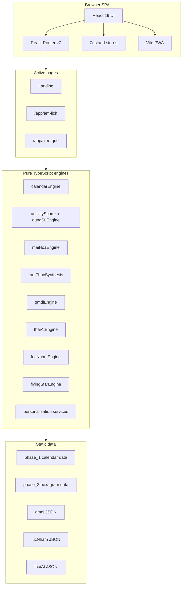

# Lich Viet v3

Vietnamese lunar calendar, auspicious-day analysis, and divination tools in a focused client-side web app.

Lich Viet v3 is a reset from the broader v2 suite. The app now centers on three surfaces: the landing page, Am Lich for calendar and Dung Su workflows, and Gieo Que for Mai Hoa and Tam Thuc divination. Removed v2-era modules such as Tu Vi, Chiem Tinh, Than So Hoc, Hop La, Bat Tu, admin, premium gating, credits, 2FA, PDF export, onboarding, and widgets are intentionally outside the current v3 scope.

## What v3 Includes

| Area            | Current scope                                                                                          |
| --------------- | ------------------------------------------------------------------------------------------------------ |
| Landing         | Product intro, birthday entry, cosmic weather card, testimonials, pricing placeholder                  |
| Am Lich         | Solar-lunar lookup, month calendar, day detail, Vietnamese holidays, good/bad hours, travel directions |
| Dung Su         | Activity selection, date scoring, factor breakdowns, best-time guidance, QMDJ cross-reference          |
| Gieo Que        | Mai Hoa hexagrams, Tam Thuc synthesis, QMDJ, Thai At, Luc Nham                                         |
| Personalization | Authenticated birthday-based day, activity, and hour scoring without premium gating                    |
| Core packages   | `@lich-viet/core/*` and `@lich-viet/types` aliases for portable engine exports                         |

## Architecture

Lich Viet v3 is a browser-only React SPA. There is no backend server in this repo; calculation work runs in TypeScript engines, static JSON datasets, and lightweight client state.


```mermaid
graph TB
    subgraph Browser["Browser SPA"]
        UI["React 19 UI"]
        Router["React Router v7"]
        Store["Zustand stores"]
        PWA["Vite PWA"]
    end

    subgraph Pages["Active pages"]
        Landing["Landing"]
        AmLich["/app/am-lich"]
        GieoQue["/app/gieo-que"]
    end

    subgraph Engines["Pure TypeScript engines"]
        Calendar["calendarEngine"]
        DungSu["activityScorer + dungSuEngine"]
        MaiHoa["maiHoaEngine"]
        TamThuc["tamThucSynthesis"]
        QMDJ["qmdjEngine"]
        ThaiAt["thaiAtEngine"]
        LucNham["lucNhamEngine"]
        FlyingStar["flyingStarEngine"]
        Personal["personalization services"]
    end

    subgraph Data["Static data"]
        Phase1["phase_1 calendar data"]
        Phase2["phase_2 hexagram data"]
        QmdjData["qmdj JSON"]
        LucNhamData["lucNham JSON"]
        ThaiAtData["thaiAt JSON"]
    end

    UI --> Router --> Pages
    UI --> Store
    UI --> PWA
    Pages --> Engines
    Engines --> Data
```

## Tech Stack

| Layer       | Technology                                                           |
| ----------- | -------------------------------------------------------------------- |
| Framework   | React 19 + TypeScript 5.9                                            |
| Build       | Vite 7                                                               |
| Styling     | Tailwind CSS v4, vanilla CSS, self-hosted Noto Sans/Noto Serif fonts |
| Routing     | React Router DOM v7                                                  |
| State       | Zustand v5                                                           |
| Validation  | Zod v4                                                               |
| PWA         | vite-plugin-pwa                                                      |
| Testing     | Vitest, Testing Library, JSDOM, Playwright                           |
| Lint/format | ESLint 9 flat config, jsx-a11y, Prettier                             |

## Getting Started

### Requirements

- Node.js 20 or newer
- npm 10 or newer

### Install and Run

```bash
git clone git@github.com:jakessteve/lich-viet.git
cd lich-viet
npm install
npm run dev
```

The Vite dev server prints the local URL after startup.

## Scripts

| Command                 | Purpose                                        |
| ----------------------- | ---------------------------------------------- |
| `npm run dev`           | Start the local Vite dev server                |
| `npm run build`         | Run TypeScript and create a production build   |
| `npm run preview`       | Preview the production build locally           |
| `npm test`              | Run the Vitest suite once                      |
| `npm run test:watch`    | Run Vitest in watch mode                       |
| `npm run test:coverage` | Run Vitest with coverage                       |
| `npm run test:e2e`      | Run Playwright end-to-end tests                |
| `npm run typecheck`     | Run TypeScript without emitting files          |
| `npm run lint`          | Lint `src`, `packages`, and `test`             |
| `npm run lint:fix`      | Auto-fix lint issues where possible            |
| `npm run format`        | Format source, package, script, and test files |
| `npm run format:check`  | Check formatting                               |
| `npm run validate:data` | Validate static data files                     |
| `npm run docs:api`      | Generate TypeDoc API docs                      |

## Repository Layout

```text
src/
├── App.tsx                 # Root routing and app layout
├── components/             # Feature, page, layout, and shared UI
├── config/                 # API, scoring, and theme configuration
├── data/                   # Static calendar and divination datasets
├── hooks/                  # React hooks used by the app surface
├── i18n/                   # Vietnamese and English locale files
├── router/                 # Route constants, lazy pages, redirects
├── services/               # Analytics and v3 personalization services
├── stores/                 # Zustand app and auth stores
├── styles/                 # Self-hosted fonts and feature CSS
├── types/                  # Shared TypeScript declarations
└── utils/                  # Pure calculation engines

packages/
├── core/                   # @lich-viet/core engine barrel exports
└── types/                  # @lich-viet/types shared type exports

test/
├── engines/                # Focused engine regression tests
├── stores/                 # Zustand store tests
└── utils/                  # Utility tests

docs/
├── tech/                   # Architecture, function map, UI/UX, user flow
├── biz/                    # Paid-tier planning
└── log/                    # Changelog, sprint log, incident log
```

## Active Routes

| Route                            | Notes                               |
| -------------------------------- | ----------------------------------- |
| `/`                              | Standalone landing page             |
| `/app/am-lich`                   | Main calendar and Dung Su workspace |
| `/app/gieo-que`                  | Mai Hoa and Tam Thuc workspace      |
| `/app/cai-dat`                   | Settings                            |
| `/app/dang-nhap`, `/app/dang-ky` | Local auth screens                  |
| `/app/nang-cap`                  | Coming-soon upgrade/pricing page    |

Legacy v2 paths redirect into the v3 app instead of exposing removed modules.

## Testing Focus

The current test suite emphasizes deterministic engine behavior and small app-state contracts:

- Calendar, Can Chi, foundational layers, auspicious hours, and Dung Su scoring
- Mai Hoa, Tam Thuc, QMDJ, Thai At, Luc Nham, and Flying Star engines
- Personal day, activity, and hour scoring
- App, auth, and feature-flag stores
- Formatting helpers and test setup

Run `npm test` for the local regression suite before shipping code changes.

## Documentation

- [Changelog](./CHANGELOG.md)
- [Security](./SECURITY.md)
- [Technical Architecture](./docs/tech/ARCHITECTURE.md)
- [Function Map](./docs/tech/FUNCTIONS.md)
- [UI/UX Notes](./docs/tech/UI_UX.md)
- [User Flow](./docs/tech/USERFLOW.md)
- [Paid Tiers](./docs/biz/PAID_TIERS.md)

## License

MIT © Lich Viet contributors
