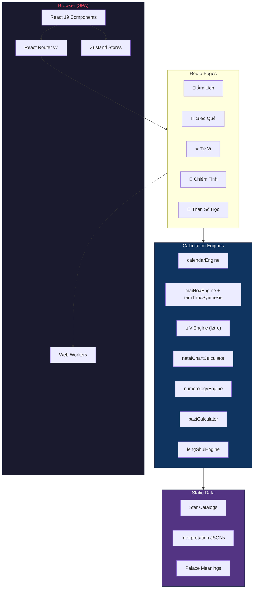

# Architecture — Lịch Việt v2

## Overview

Lịch Việt v2 is a **client-side Single Page Application (SPA)** — there is no backend server. All computation runs entirely in the browser. The application is structured in three layers: **UI → State → Engine**.

## Technology Stack

| Layer | Technology | Version |
|---|---|---|
| Framework | React + TypeScript | 19.x + 5.8 |
| Build Tool | Vite | 7.x |
| Styling | Tailwind CSS v4 + Vanilla CSS | 4.x |
| State Management | Zustand | 5.x |
| Routing | React Router DOM | 7.x |
| Validation | Zod | 4.x |
| Testing | Vitest + @testing-library/react | 4.x |
| Linting | ESLint 9 (flat config) + Prettier | 10.x |
| CI | GitHub Actions | — |

## High-Level Architecture



## Source Directory Layout

```
src/
├── components/     React UI components, organized by feature
├── config/         App-wide configuration constants
├── data/           Static JSON datasets (star catalogs, interpretations)
├── hooks/          Custom React hooks (usePageTitle, useIsMobile, etc.)
├── i18n/           Vietnamese translations and locale data
├── router/         Route definitions and lazy-loaded page imports
├── schemas/        Zod validation schemas for user input
├── services/       External API integrations (geocoding, holidays)
├── stores/         Zustand state slices (calendar, settings, user)
├── styles/         Feature-specific CSS and self-hosted font declarations
├── types/          Shared TypeScript type definitions
├── utils/          Core calculation engines (9 divination + calendar)
├── workers/        Web Workers for offloading heavy computation
└── index.css       Design system tokens, shared utilities, animations
```

## Module Aliasing

Vite is configured with path aliases for clean imports:

| Alias | Target |
|---|---|
| `@/` | `src/` |
| `@lich-viet/core` | `packages/core/src/index.ts` |
| `@lich-viet/types` | `packages/types/src/index.ts` |

## Engine Layer

The engine layer contains pure TypeScript functions with **zero React dependencies**, making them testable and portable. Each engine follows the same pattern: input data → pure computation → structured output.

| Engine | Input | Output |
|---|---|---|
| `calendarEngine` | Solar date | Lunar date, Can Chi, stars, auspicious hours |
| `activityScorer` | Date + activity | Weighted score from 8 evaluation layers |
| `baziCalculator` | Birth date/time | Four Pillars, Thập Thần, luck cycles |
| `tuViEngine` | Birth date/time/gender | 12-palace chart with 115+ stars |
| `natalChartCalculator` | Birth date/time/location | Western natal chart with aspects |
| `numerologyEngine` | Full name + birth date | Life Path, Expression, Soul Urge, cycles |
| `maiHoaEngine` | Time or numbers | Hexagram triplet with Thể/Dụng analysis |
| `tamThucSynthesis` | Date/time | Thái Ất, QMDJ, and Lục Nhâm boards |
| `fengShuiEngine` | Period + facing direction | Flying Star 9-palace grid |

## State Management

Zustand stores manage application state with minimal boilerplate:

- **Calendar Store** — selected date, lunar conversion cache, view mode
- **Settings Store** — dark mode, locale, display preferences
- **User Store** — birth profiles for personalized readings

## Performance Strategies

- **Code Splitting** — 25+ `React.lazy()` calls for route-level and feature-level splitting
- **Vendor Chunking** — Heavy libraries (`iztro`, `leaflet`, `circular-natal-horoscope-js`) are isolated into separate chunks
- **Web Workers** — Heavy calculations offloaded from the main thread
- **Memoization** — `useMemo` and `useCallback` for expensive computations
- **Tree Shaking** — `sideEffects: false` enabled in `package.json`

## Build & Deployment

```bash
npm run build        # TypeScript check + Vite production build
npm run preview      # Preview production build locally
```

Output is a static bundle in `dist/` — deployable to any static hosting (Vercel, Netlify, GitHub Pages, S3, etc.).

## Testing

- **Framework:** Vitest with JSDOM environment
- **Coverage:** 712+ tests across 43 files
- **Structure:** Tests organized by development phase in `test/`
- **CI:** GitHub Actions runs lint → type-check → test → build on every push
