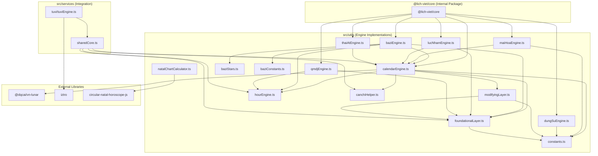

# Engine Dependency Graph

This document outlines the architectural relationships and data flow between the various calculation engines in Lịch Việt v2.

## Dependency Visualization

## Engine Breakdown

### 1. Lunar Calendar Engine (`calendarEngine.ts`)
The primary orchestrator for calendar data. It provides lunar dates, Can-Chi for years/months/days, and day quality assessments.
- **Status**: Serving as the "Canonical Source" for all Eastern domain engines.
- **Key Dependencies**: `@dqcai/vn-lunar`, `foundationalLayer.ts`, `modifyingLayer.ts`.

### 2. Foundational & Modifying Layers
- **Foundational Layer (`foundationalLayer.ts`)**: Handles astronomical constants, Julian Day Number (JDN), solar terms (Tiết Khí), and the "Hiệp Kỷ Biện Phương Thư" scoring system.
- **Modifying Layer (`modifyingLayer.ts`)**: Implements the "Ngọc Hạp Thông Thư" overlay, adding specific stars (Cát Thần, Hung Thần) and Trực/Tú calculations.

### 3. Bát Tự (Bazi) Engine (`baziEngine.ts`)
Generates the Four Pillars of Destiny chart.
- **Architecture**: A thin orchestrator that delegates analysis to `baziStars.ts`.
- **Key Dependencies**: `calendarEngine.ts` (for pillars), `foundationalLayer.ts` (for solar month boundaries).

### 4. Oracle & Divination Engines
- **Mai Hoa Engine (`maiHoaEngine.ts`)**: Plum Blossom Numerology. Depends on `calendarEngine.ts` for time-based inputs.
- **Lục Nhâm Engine (`lucNhamEngine.ts`)**: Đại Lục Nhâm. Uses `foundationalLayer.ts` to determine the "Nguyệt Tướng" (Solar Month).
- **QMDJ Engine (`qmdjEngine.ts`)**: Kỳ Môn Độn Giáp. Uses `foundationalLayer.ts` for solar term boundaries and `hourEngine.ts` for the "Trực Phù/Trực Sử".
- **Thái Ất Engine (`thaiAtEngine.ts`)**: Thái Ất Thần Số. Depends on `calendarEngine.ts` for the yearly cycle.

### 5. Integration Services
- **Shared Core (`sharedCore.ts`)**: A bridge that surfaces Phase 1 (Core) data to Phase 3 (Tử Vi). It ensures that the lunar dates used in Tử Vi charts are consistent with the main calendar.
- **Tử Vi Engine (`src/services/tuvi`)**: A wrapper around the `iztro` library, enhanced with custom Vietnamese interpretations and shared core validation.
- **Chiêm Tinh Engine (`src/utils/natalChartCalculator.ts`)**: A wrapper around `circular-natal-horoscope-js` for Western astrology.

## Data Flow Principles
1. **Unidirectional Flow**: Low-level utilities (`constants`, `foundationalLayer`) never depend on high-level engines.
2. **Calendar as Truth**: All Eastern engines MUST use `calendarEngine.ts` or `foundationalLayer.ts` for date/time conversion to ensure academic consistency.
3. **Pure Logic**: Engines in `src/utils` are designed to be "pure" business logic, enabling their extraction into `@lich-viet/core`.
