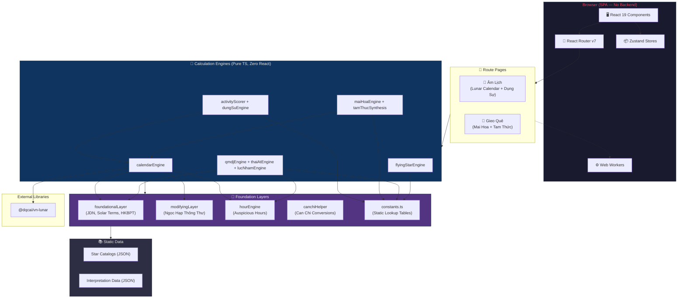
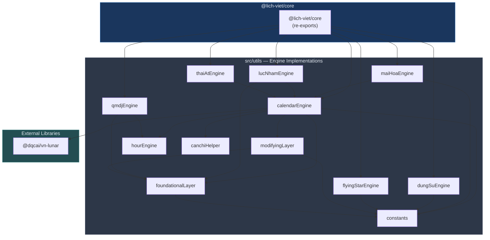
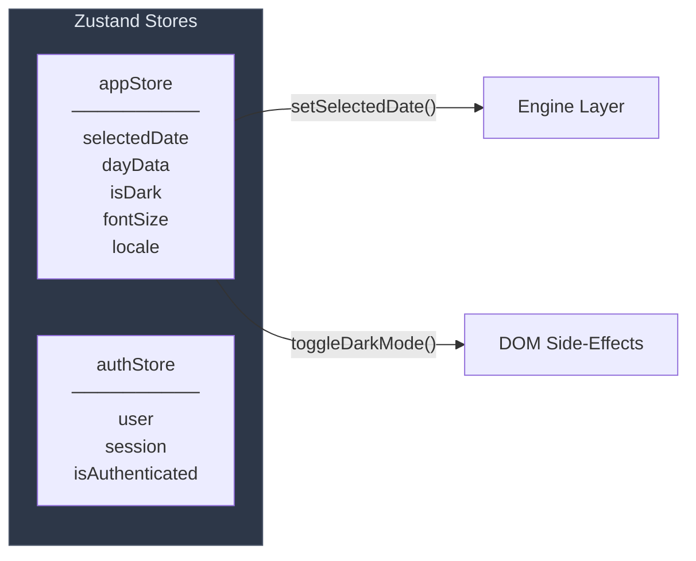

# Technical Architecture — Lịch Việt v3

> **Version:** 3.0.0 | **Updated:** May 2026
> **Source of Truth** for all agents and LLMs working on this project.

---

## 1. Overview

Lịch Việt v3 is a **client-side Single Page Application (SPA)** — there is no backend server. All computation runs entirely in the browser. The application is structured in three layers: **UI → State → Engine**.

The app provides solar–lunar date conversion, auspicious day analysis (Dụng Sự), and the active divination engines used by Mai Hoa, Tam Thuc, QMDJ, Thai At, Luc Nham, and Flying Star workflows — all running entirely client-side as a React SPA with Web Worker offloading for heavy computations.

The app surface is **3 pages**: Landing, Âm Lịch (Lunar Calendar + Dụng Sự), and Gieo Quẻ (Mai Hoa + Tam Thuc).

---

## 2. Technology Stack

| Layer                | Technology                          | Version    |
| -------------------- | ----------------------------------- | ---------- |
| **Framework**        | React + TypeScript                  | 19.x + 5.9 |
| **Build Tool**       | Vite                                | 7.3.x      |
| **Styling**          | Tailwind CSS v4 + Vanilla CSS       | 4.2.x      |
| **State Management** | Zustand                             | 5.0.x      |
| **Routing**          | React Router DOM                    | 7.13.x     |
| **Validation**       | Zod                                 | 4.3.x      |
| **Testing**          | Vitest + JSDOM + Playwright         | 4.0.x      |
| **Linting**          | ESLint 9 (flat config) + Prettier 3 | 9.x        |
| **PWA**              | vite-plugin-pwa + Service Worker    | 1.2.x      |
| **CI**               | GitHub Actions                      | —          |

### Key External Libraries

| Library            | Purpose                                |
| ------------------ | -------------------------------------- |
| `@dqcai/vn-lunar`  | Vietnamese Lunar Calendar calculations |
| `lunar-javascript` | Additional lunar calendar utilities    |

---

## 3. High-Level Architecture



---

## 4. Source Directory Layout

```
Lịch Việt v3/
├── src/                        # Application source
│   ├── App.tsx                 # Root component (routing + layout)
│   ├── main.tsx                # React DOM entry point
│   ├── index.css               # Design system tokens (800 lines)
│   ├── components/             # React UI components (by feature)
│   │   ├── layout/             # AppNav, AppSidebar, MobileDrawer, AppFooter
│   │   ├── shared/             # Reusable components
│   │   ├── pages/              # Landing, Âm Lich, auth, settings, upgrade
│   │   ├── Calendar/           # Month/Day calendar views
│   │   ├── MaiHoa/             # Plum Blossom hexagram
│   │   ├── TamThuc/            # QMDJ + Thái Ất + Lục Nhâm
│   │   ├── GieoQue/            # Divination container
│   │   └── LichDungSu/         # Activity calendar
│   ├── config/                 # App-wide configuration
│   │   ├── api.ts              # API endpoint config
│   │   ├── formConstants.ts    # Form field constants
│   │   ├── scoring.ts          # Activity scoring config
│   │   └── theme.ts            # Score label/color mapping
│   ├── data/                   # Static JSON datasets
│   ├── hooks/                  # Custom React hooks
│   ├── i18n/                   # Vietnamese translations
│   ├── router/                 # Route definitions + lazy imports
│   ├── services/               # Business logic services
│   ├── stores/                 # Zustand state (app, auth)
│   ├── styles/                 # Feature-specific CSS
│   ├── types/                  # Shared TypeScript definitions
│   ├── utils/                  # Core calculation engines
│   ├── workers/                # Web Workers (engineWorker)
├── packages/                   # Monorepo packages
│   ├── core/                   # @lich-viet/core (engine re-exports)
│   └── types/                  # @lich-viet/types (shared types)
├── test/                       # Centralized test suite
│   ├── phase_1/ → phase_4/    # Tests by development phase
│   ├── integration/            # Cross-module integration tests
│   ├── performance/            # Performance benchmarks
│   ├── snapshot/               # Snapshot regression tests
│   ├── hooks/                  # Hook tests
│   ├── services/               # Service tests
│   ├── stores/                 # Store tests
│   ├── utils/                  # Utility tests
│   └── *-battle-test.test.ts   # Edge-case battle tests
├── scripts/                    # Build/validation scripts
├── docs/                       # Documentation
│   ├── tech/                   # Technical architecture docs
│   ├── biz/                    # Business docs
│   ├── log/                    # Sprint/incident logs
│   └── archive/                # Historical phase documents
└── public/                     # Static assets (icons, fonts, SW)
```

---

## 5. Module Aliasing

Vite is configured with path aliases for clean imports:

| Alias               | Target                                 |
| ------------------- | -------------------------------------- |
| `@/`                | `src/`                                 |
| `@lich-viet/core`   | `packages/core/src/index.ts`           |
| `@lich-viet/core/*` | `packages/core/src/*` (barrel exports) |
| `@lich-viet/types`  | `packages/types/src/index.ts`          |

---

## 6. Engine Catalog

The engine layer contains pure TypeScript functions with **zero React dependencies**, making them testable and portable. Each engine follows: `input data → pure computation → structured output`.

| #   | Engine              | File                                      | Input              | Output                                       |
| --- | ------------------- | ----------------------------------------- | ------------------ | -------------------------------------------- |
| 1   | **Calendar**        | `calendarEngine.ts`                       | Solar date         | Lunar date, Can Chi, stars, auspicious hours |
| 2   | **Activity Scorer** | `activityScorer.ts`                       | Date + activity    | Weighted score from 8 evaluation layers      |
| 3   | **Dụng Sự**         | `dungSuEngine.ts`, `dungSuSuggester.ts`   | Date + activity    | Activity grouping and recommendations        |
| 4   | **Mai Hoa**         | `maiHoaEngine.ts`, `maiHoaInterpreter.ts` | Time or numbers    | Hexagram triplet + Thể/Dụng analysis         |
| 5   | **QMDJ**            | `qmdjEngine.ts`, `qmdjScorer.ts`          | Date + activity    | Nine-palace chart and scoring helpers        |
| 6   | **Thai At**         | `thaiAtEngine.ts`                         | Year or date       | Thai At year and month overlays              |
| 7   | **Luc Nham**        | `lucNhamEngine.ts`                        | Date/time          | Heaven/Earth board and verdicts              |
| 8   | **Tam Thức**        | `tamThucSynthesis.ts`                     | Date/time          | Thái Ất + QMDJ + Lục Nhâm boards             |
| 9   | **Phi Tinh**        | `flyingStarEngine.ts`                     | Period + direction | Flying Star 9-palace Luo Shu grid            |

---

## 7. Engine Dependency Graph



### Data Flow Principles

1. **Unidirectional Flow** — Low-level utilities (`constants`, `foundationalLayer`) never depend on high-level engines.
2. **Calendar as Truth** — All Eastern engines MUST use `calendarEngine.ts` or `foundationalLayer.ts` for date/time conversion to ensure academic consistency.
3. **Pure Logic** — Engines in `src/utils` are designed to be "pure" business logic with zero React or DOM dependencies.

---

## 8. State Management

Zustand stores manage application state with minimal boilerplate:



| Store       | Responsibility                              | Persistence    |
| ----------- | ------------------------------------------- | -------------- |
| `appStore`  | Calendar date, dark mode, font size, locale | `localStorage` |
| `authStore` | User session, authentication state          | `localStorage` |

---

## 9. Performance Strategies

| Strategy           | Implementation                                                              |
| ------------------ | --------------------------------------------------------------------------- |
| **Code Splitting** | `React.lazy()` calls for route-level and feature-level splitting            |
| **Web Workers**    | Heavy calculations offloaded from main thread via `engineWorker.worker.ts`  |
| **Memoization**    | `useMemo` and `useCallback` for expensive computations                      |
| **Tree Shaking**   | `sideEffects: false` in `package.json`                                      |
| **Compression**    | `vite-plugin-compression2` for Brotli/Gzip pre-compression                  |
| **PWA**            | Service Worker with precache + stale-while-revalidate via `vite-plugin-pwa` |

---

## 10. Build & Deployment

```bash
npm run dev          # Vite dev server (HMR)
npm run build        # TypeScript check + Vite production build
npm run preview      # Preview production build locally
```

Output is a static bundle in `dist/` — deployable to any static hosting.

| Platform    | Status     | Config File                    |
| ----------- | ---------- | ------------------------------ |
| **Vercel**  | Configured | `vercel.json` (SPA rewrites)   |
| **Netlify** | Configured | `netlify.toml` (SPA redirects) |

### CI Pipeline (GitHub Actions)

```
lint → typecheck → test → build
```

---

## 11. Testing Infrastructure

| Framework                  | Purpose                        | Config                 |
| -------------------------- | ------------------------------ | ---------------------- |
| **Vitest**                 | Unit + Integration tests       | `vitest.config.ts`     |
| **@testing-library/react** | Component rendering tests      | —                      |
| **JSDOM**                  | DOM environment for unit tests | —                      |
| **Playwright**             | E2E browser tests              | `playwright.config.ts` |
| **@vitest/coverage-v8**    | Code coverage                  | —                      |

### Test Organization

| Directory                    | Content                              |
| ---------------------------- | ------------------------------------ |
| `test/phase_1/` → `phase_4/` | Tests organized by development phase |
| `test/integration/`          | Cross-module integration tests       |
| `test/performance/`          | Performance benchmarks               |
| `test/snapshot/`             | Snapshot regression tests            |
| `test/*-battle-test.test.ts` | Edge-case stress tests               |

### Commands

```bash
npm run test           # Run all tests
npm run test:watch     # Watch mode
npm run test:coverage  # With coverage report
npm run test:e2e       # Playwright E2E tests
```

---

## 12. Security Model

| Layer                | Current Implementation                                    |
| -------------------- | --------------------------------------------------------- |
| **CSP**              | Content Security Policy via `<meta>` tags in `index.html` |
| **Input Validation** | Zod schemas on all engine inputs                          |
| **XSS**              | React's built-in JSX escaping + CSP                       |
| **Env Management**   | `.env.example` template, no secrets in client bundle      |
| **HTTPS**            | Enforced by hosting providers (Vercel/Netlify)            |

---

## 13. Monetization Architecture (v3.0.0)

All active features in v3.0.0 are free. There is no live tier gating, no credit system, and no premium paywall.

Any future premium work should be treated as a new product decision and documented separately from the current v3 release.

---

> **Note:** Update this document whenever the architecture changes. All agents reference this as the Source of Truth for project structure and technical decisions.
