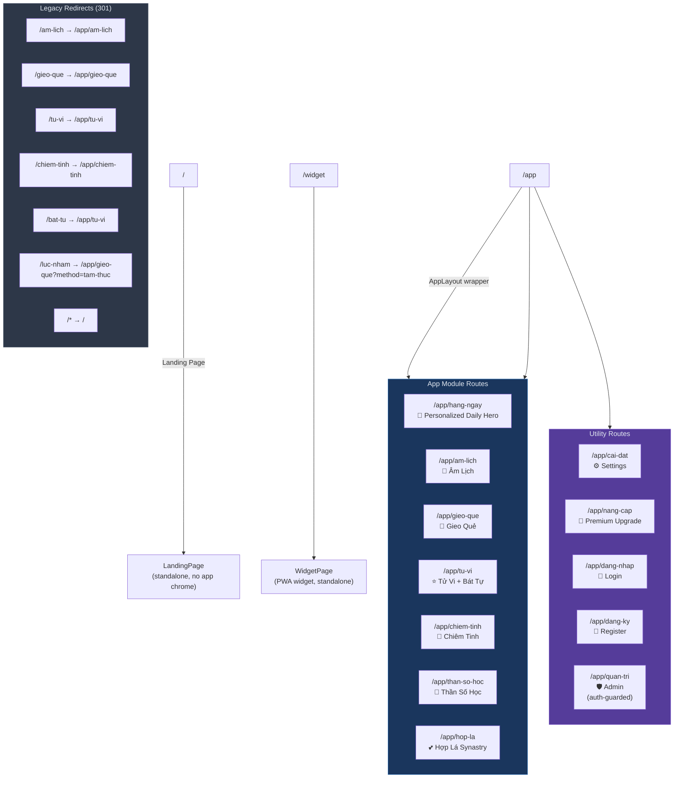
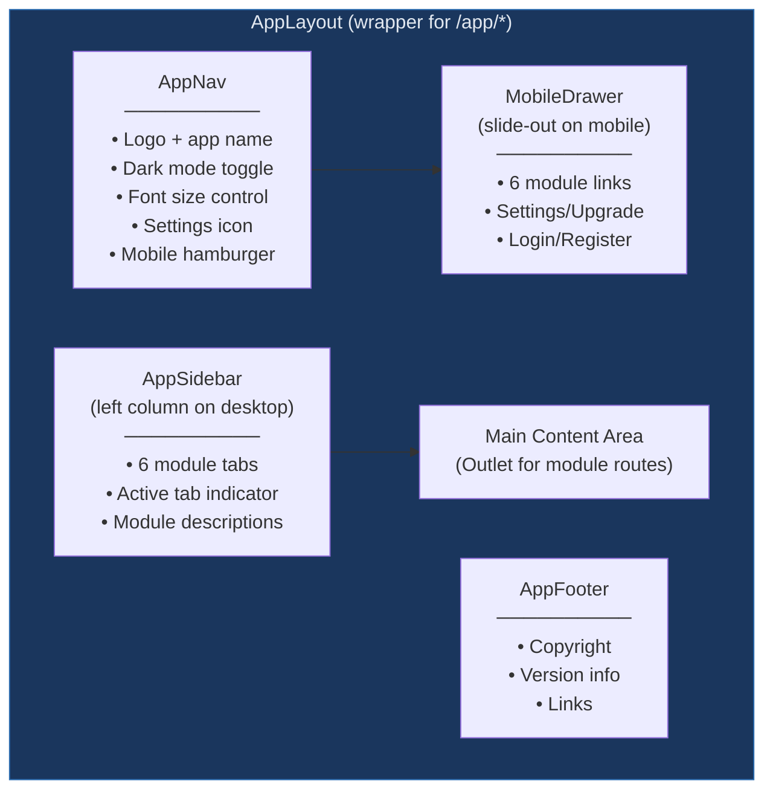
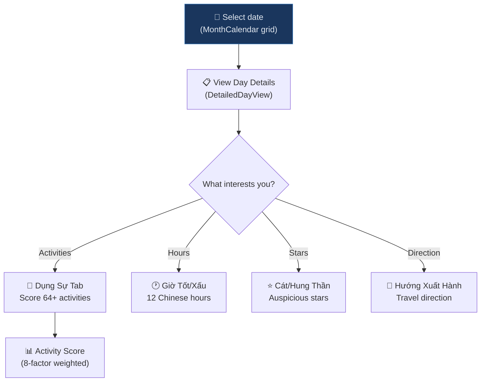
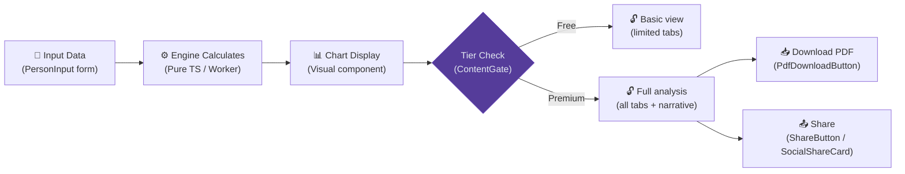
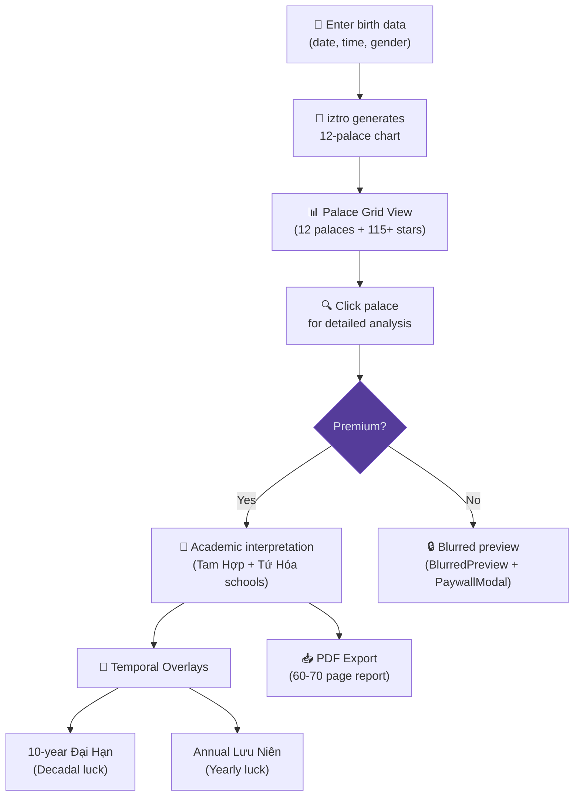
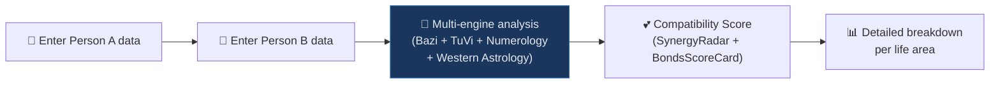
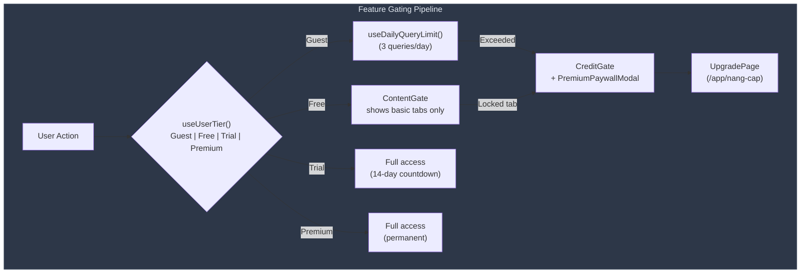
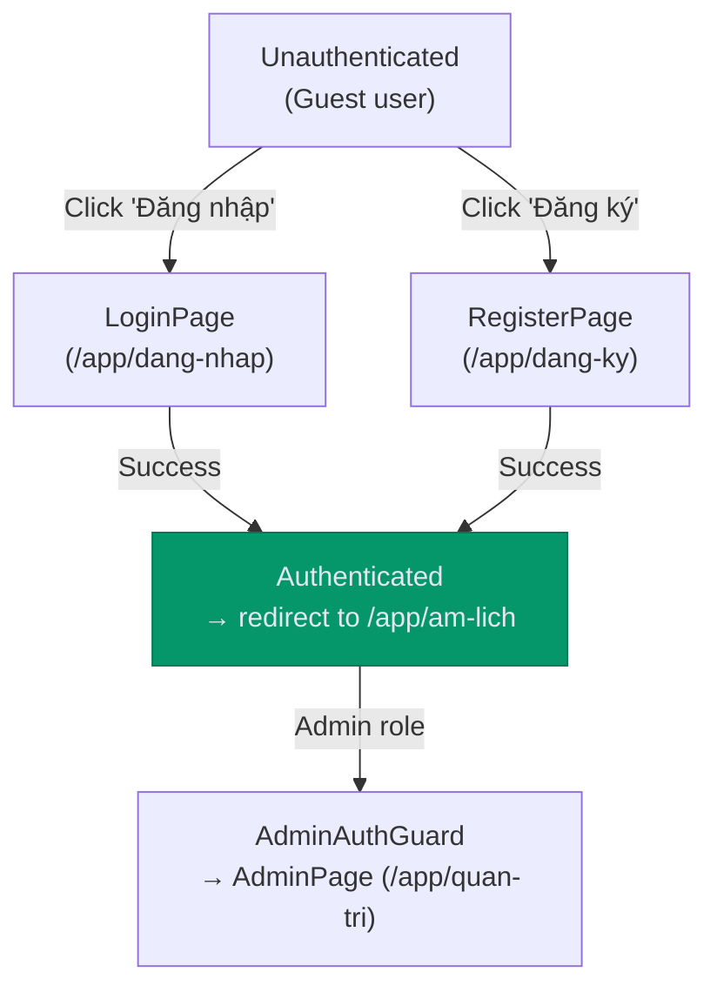
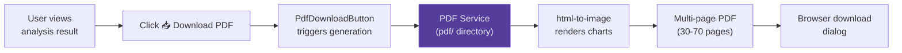

# User Flows & Navigation — Lịch Việt v2

> **Version:** 2.3.0 | **Updated:** April 2026
> Complete user journey documentation for all app modules, navigation, and feature gating.

---

## 1. Route Map



### Route → Tab Mapping

| Route | Sidebar Tab | Notes |
|---|---|---|
| `/app/hang-ngay` | `am-lich` | Default redirect from `/app` |
| `/app/am-lich` | `am-lich` | Main calendar view |
| `/app/lich-dung-su` | `am-lich` | Redirects to am-lich |
| `/app/phong-thuy` | `am-lich` | Redirects to am-lich |
| `/app/gieo-que` | `gieo-que` | Mai Hoa + Tam Thức |
| `/app/tu-vi` | `tu-vi` | Tử Vi + Bát Tự |
| `/app/chiem-tinh` | `chiem-tinh` | Western astrology |
| `/app/than-so-hoc` | `than-so-hoc` | Numerology |
| `/app/hop-la` | `hop-la` | Synastry / compatibility |

---

## 2. Navigation Architecture



### Responsive Behavior

| Viewport | Navigation | Sidebar |
|---|---|---|
| **Desktop** (≥ 1024px) | Top nav bar | Left sidebar with tab labels |
| **Tablet** (768-1023px) | Top nav bar | Collapsed icon-only sidebar |
| **Mobile** (< 768px) | Top nav + hamburger | Slide-out drawer (MobileDrawer) |

---

## 3. Core User Journeys

### 3.1 First-Time User Flow


**Onboarding Quiz** (`OnboardingQuiz.tsx`):
1. "What brought you here?" → Sets `userGoal` in appStore
2. Goal options: `calendar` | `self_discovery` | `feng_shui`
3. Persisted to `localStorage`; affects Daily Hero personalization

**Guided Tour** (`GuidedTour.tsx` + `OnboardingTour.tsx`):
- Step-by-step highlights of key features
- Skip-able, shown only on first visit

---

### 3.2 Lunar Calendar Journey



---

### 3.3 Divination Engine Journey (Generic)

All divination engines follow the same UX pattern:



**Input Pattern** (`PersonInput.tsx`):
- Full name (Vietnamese-normalized)
- Birth date (solar calendar)
- Birth time (hour selection or exact time)
- Gender (male/female)
- Birth location (geocoding search — Chiêm Tinh only)

---

### 3.4 Tử Vi Journey (Detailed)



---

### 3.5 Hợp Lá (Synastry) Journey



---

## 4. Feature Gating System



### Gating Components

| Component | Purpose |
|---|---|
| `ContentGate.tsx` | Wraps premium content sections; shows/hides based on tier |
| `CreditGate.tsx` | Free-tier credit check before engine calculation |
| `BlurredPreview.tsx` | Glassmorphism blur over locked premium content |
| `PremiumPaywallModal.tsx` | Upgrade prompt with feature comparison |
| `UpgradeBanner.tsx` | Inline banner promoting premium upgrade |
| `TierBadge.tsx` | Visual badge showing current user tier |
| `DailyQueryCounter.tsx` | Shows remaining free queries for the day |
| `CreditRefreshBanner.tsx` | Banner showing when free credits refresh |

---

## 5. Auth Flow



---

## 6. Page Module Summary

### Main Modules (with sidebar tab)

| Module | Route | Engine(s) Used | Key Components |
|---|---|---|---|
| **Hàng Ngày** | `/app/hang-ngay` | Calendar, Activity Scorer | `PersonalizedDailyHero` |
| **Âm Lịch** | `/app/am-lich` | Calendar, Dụng Sự, Flying Star, Feng Shui | `MonthCalendar`, `DetailedDayView`, `DayCell` |
| **Gieo Quẻ** | `/app/gieo-que` | Mai Hoa, QMDJ, Thái Ất, Lục Nhâm | `GieoQueView` (tabbed: Mai Hoa / Tam Thức) |
| **Tử Vi** | `/app/tu-vi` | Tử Vi (iztro), Bát Tự | `TuViPage` (tabbed sub-views) |
| **Chiêm Tinh** | `/app/chiem-tinh` | Natal Chart, Transits, Sky Projection | `ChiemTinhView` (chart + star map) |
| **Thần Số Học** | `/app/than-so-hoc` | Numerology | `NumerologyView` |
| **Hợp Lá** | `/app/hop-la` | Multi-engine synastry | `HopLaPage` |

### Utility Pages (no sidebar tab)

| Page | Route | Purpose |
|---|---|---|
| **Settings** | `/app/cai-dat` | Theme, font, locale, profile management |
| **Upgrade** | `/app/nang-cap` | Premium tier comparison and purchase |
| **Login** | `/app/dang-nhap` | User authentication |
| **Register** | `/app/dang-ky` | New account creation |
| **Admin** | `/app/quan-tri` | Admin panel (auth-guarded) |

---

## 7. Data Entry Patterns

### Standard Birth Data Form

Used across Tử Vi, Bát Tự, Chiêm Tinh, Thần Số Học, and Hợp Lá:

```
┌──────────────────────────────────┐
│  PersonInput Component           │
│  ┌────────────┐ ┌──────────────┐ │
│  │ Full Name  │ │ Birth Date   │ │
│  │ (text)     │ │ (date picker)│ │
│  └────────────┘ └──────────────┘ │
│  ┌────────────┐ ┌──────────────┐ │
│  │ Birth Time │ │ Gender       │ │
│  │ (combo)    │ │ (select)     │ │
│  └────────────┘ └──────────────┘ │
│  ┌────────────────────────────┐  │
│  │ Birth Location (optional)  │  │
│  │ (geocoding search)         │  │
│  └────────────────────────────┘  │
│         [ Xem Kết Quả ]         │
└──────────────────────────────────┘
```

### Analysis Result Pattern

```
┌──────────────────────────────────┐
│  [Tab Nav: EngineTabNav]         │
│  Overview | Details | Advanced   │
├──────────────────────────────────┤
│  [Data Summary Bar]             │
│  Key metrics at a glance        │
├──────────────────────────────────┤
│  [Analysis Cards]               │
│  ┌──────────┐ ┌──────────┐     │
│  │ Card 1   │ │ Card 2   │     │
│  │(collaps.)│ │(collaps.)│     │
│  └──────────┘ └──────────┘     │
├──────────────────────────────────┤
│  [Actions: PDF | Share | Save]  │
└──────────────────────────────────┘
```

---

## 8. PDF Export Flow



### PDF Report Variants

| Variant | Vietnamese Name | Focus | Pages |
|---|---|---|---|
| **Identity** | Bản Sắc Cá Nhân | Core personality, archetypes | ~30 |
| **Career** | Chiến Lược Sự Nghiệp | Wealth, professional path | ~30 |
| **Love** | Gắn Kết & Tình Duyên | Relationship patterns | ~30 |
| **Yearly** | Vận Trình Năm [Year] | Quarterly outlook | ~30 |
| **Master** | Hồ Sơ Vận Mệnh | All above + technical appendix | ~70 |

---

> **Note:** All user flows are subject to the Feature Gating System (§4). Guest users have the most restricted access; Premium users have full access to all features and export capabilities.
