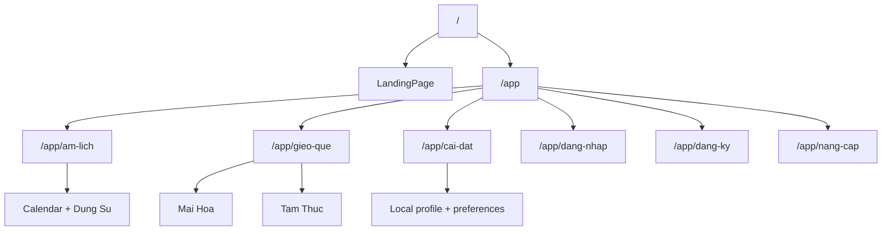

# User Flow Reference - Lich Viet v3

> **Version:** 3.0.0 | **Updated:** May 2026
> Current navigation and user-flow reference for the active v3 app.

---

## 1. Route Map

| Route            | Status      | Destination                                   |
| ---------------- | ----------- | --------------------------------------------- |
| `/`              | Active      | Landing                                       |
| `/app/am-lich`   | Active      | Calendar, Dung Su, and personalization panels |
| `/app/gieo-que`  | Active      | Mai Hoa and Tam Thuc                          |
| `/app/cai-dat`   | Active      | Settings                                      |
| `/app/dang-nhap` | Active      | Demo login                                    |
| `/app/dang-ky`   | Active      | Demo registration                             |
| `/app/nang-cap`  | Placeholder | Coming-soon pricing/upgrade                   |

Removed legacy routes redirect to active v3 pages.

---

## 2. Primary Flows

### Landing

1. User lands on `/`.
2. User can view the current product positioning and try the birthday/date entry.
3. Primary app entry routes to `/app/am-lich`.

### Am Lich

1. User opens `/app/am-lich`.
2. Sidebar calendar controls the selected date.
3. The page shows lunar date details, auspicious hours, activity guidance, holidays, and related panels.
4. Authenticated users with birthday data can see personalization signals.

### Gieo Que

1. User opens `/app/gieo-que`.
2. User chooses Mai Hoa or Tam Thuc.
3. Mai Hoa supports time-based and number-based divination.
4. Tam Thuc synthesizes QMDJ, Luc Nham, and Thai At from the selected time.

### Settings

1. User opens `/app/cai-dat`.
2. User can adjust theme, font size, locale-related preferences, profile data, and local demo-account settings.
3. Settings persist in localStorage.

---

## 3. Authentication Boundary

Auth is demo-only and stored in browser localStorage. It supports:

| Flow            | Notes                                                 |
| --------------- | ----------------------------------------------------- |
| Register        | Creates a local browser account                       |
| Login           | Checks local browser account credentials              |
| Social login    | Simulated local social account                        |
| Profile update  | Updates local user profile data                       |
| Change password | Uses salted SHA-256 hashes for local demo credentials |

A seeded demo admin account is created for local testing, but there is no active admin route, no production session layer, and no live 2FA flow.

---

## 4. Removed v3-Refactor Surfaces

The following older surfaces are intentionally absent from the active app:

| Removed Surface       | Current Behavior                         |
| --------------------- | ---------------------------------------- |
| Tu Vi                 | Legacy route redirects to `/app/am-lich` |
| Bazi                  | Legacy route redirects to `/app/am-lich` |
| Western Astrology     | Legacy route redirects to `/app/am-lich` |
| Numerology            | Legacy route redirects to `/app/am-lich` |
| Hop La                | Legacy route redirects to `/app/am-lich` |
| Admin                 | Removed from navigation                  |
| Premium/Credit gating | Removed from active flows                |
| PDF export            | Removed from active flows                |
| Onboarding tour       | Removed from active flows                |
| Widget page           | Removed from active flows                |

---

## 5. Validation Baseline

Current audit validation:

| Check                              | Status                              |
| ---------------------------------- | ----------------------------------- |
| `npm run typecheck`                | Pass                                |
| `npm run lint`                     | Pass                                |
| `npm test`                         | Pass, 151 tests                     |
| `npm run build`                    | Pass                                |
| `npm audit --audit-level=moderate` | Fails with 11 dependency advisories |
